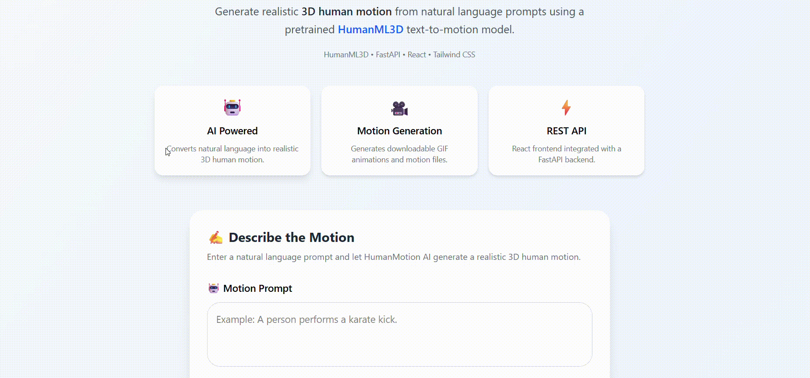

<div align="center">

# 🚀 HumanMotion AI

### Transform Natural Language into Realistic 3D Human Motion

A modern full-stack AI web application built with **React**, **FastAPI**, and **Python** for generating animated 3D human motions from text prompts.

<!-- Replace with your demo GIF -->


<br><br>


</div>

---

# 🌟 Overview

HumanMotion AI is a full-stack AI application that converts natural language descriptions into animated 3D human motions through a clean, interactive web interface.

Instead of relying on command-line scripts, users simply enter a prompt, generate an animation with a single click, preview the results, and download the generated motion files.

The project demonstrates how AI research can be integrated into a production-style application using modern frontend technologies, REST APIs, and an efficient backend architecture.

---

# ✨ Key Features

- 🎯 Generate 3D human motion from natural language
- ⚡ FastAPI REST API backend
- 🎨 Modern React + Tailwind CSS interface
- 🎞️ Automatic GIF generation
- 📦 Download generated motion (.npy)
- 📄 Metadata generation
- 📱 Responsive design
- 🚀 One-click motion generation
- 🔄 Modular project architecture

---

# 🎬 Demo Workflow

```text
Enter Prompt
      │
      ▼
Generate Motion
      │
      ▼
AI Motion Generation
      │
      ▼
Preview Animation
      │
      ▼
Download GIF • Motion File • Metadata
```

---

# 🏗️ System Architecture

```text
                User Prompt
                     │
                     ▼
         React + Tailwind Frontend
                     │
              REST API Request
                     │
                     ▼
             FastAPI Backend
                     │
                     ▼
          Motion Generation Engine
                     │
     ┌───────────────┴───────────────┐
     ▼                               ▼
 Animated GIF                  Motion (.npy)
     │                               │
     └───────────────┬───────────────┘
                     ▼
               Metadata (.json)
```

---

# 💻 Tech Stack

## Frontend

- React
- Vite
- Tailwind CSS
- JavaScript

## Backend

- FastAPI
- Python

## AI Integration

- Pretrained HumanML3D Text-to-Motion Model

## Libraries & Tools

- NumPy
- FFmpeg
- Git
- GitHub

---

# 📂 Project Structure

```text
HumanMotion-AI
│
├── frontend/
│   ├── src/
│   ├── components/
│   ├── services/
│   └── assets/
│
├── backend/
│   └── outputs/
│
├── common/
├── networks/
├── options/
├── scripts/
├── utils/
│
├── api.py
├── app.py
├── render_motion.py
├── requirements.txt
└── environment.yaml
```

---

# 🚀 Getting Started

## Clone the Repository

```bash
git clone https://github.com/kaavyadhir/HumanMotion-AI.git
cd HumanMotion-AI
```

## Create Environment

```bash
conda env create -f environment.yaml
conda activate text2motion
```

## Install Frontend

```bash
cd frontend
npm install
```

## Start Backend

```bash
uvicorn api:app --reload
```

## Start Frontend

```bash
npm run dev
```

Visit:

```text
http://localhost:5173
```

---

# ⚡ API Endpoint

## Generate Motion

**POST** `/generate`

### Request

```json
{
  "prompt": "A person walks forward and waves."
}
```

### Response

```json
{
  "success": true,
  "gif_url": "...",
  "npy_url": "...",
  "metadata_url": "..."
}
```

---

# 📸 Screenshots

## 🏠 Home Page

> _(Add screenshot here)_

---

## 🎞️ Generated Motion

> _(Add screenshot here)_

---

## 📦 Download Results

> _(Add screenshot here)_

---

# 🎯 Project Highlights

- Built a modern full-stack AI application
- Designed a responsive React frontend
- Developed a FastAPI-based backend
- Integrated a text-to-motion inference pipeline
- Automated animation rendering and file generation
- Implemented downloadable outputs and metadata
- Structured the project using modular components

---

# 🔮 Future Enhancements

- 👤 User Authentication
- ☁️ Cloud Deployment
- 🎥 MP4 Video Export
- 📜 Prompt History
- 📁 Motion Gallery
- 🎮 Interactive Motion Controls
- 📊 Analytics Dashboard

---

# 👨‍💻 About the Developer

**Kaavya Dhir**

B.Tech Computer Science Engineering  
Thapar Institute of Engineering & Technology

**GitHub:**  
https://github.com/kaavyadhir

---

# 🙏 Acknowledgment

This application integrates the pretrained HumanML3D text-to-motion model. The focus of this repository is the design and development of the full-stack web application, API integration, user interface, and deployment workflow built around the pretrained model. Credit for the underlying text-to-motion research and pretrained model belongs to the original HumanML3D authors.

---

<div align="center">

### ⭐ If you found this project interesting, consider giving it a star!

Made with ❤️ by **Kaavya Dhir**

</div>
